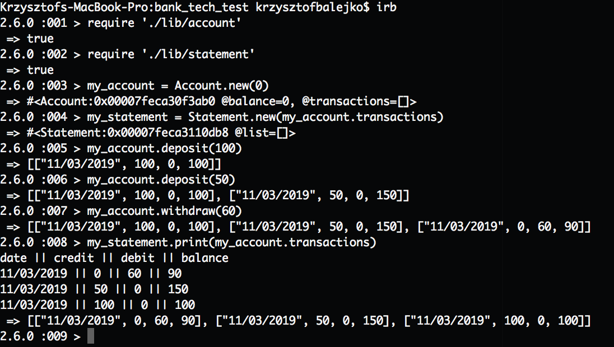

# bank-tech-test

It's week 10 at Makers Academy and hight time to start tech tests preparation.
First test given to me is a Bank tech test.

**Requirements**
```
You should be able to interact with your code via a REPL like IRB or the JavaScript console.
(You don't need to implement a command line interface that takes input from STDIN.)
Deposits, withdrawal.
Account statement (date, amount, balance) printing.
Data can be kept in memory (it doesn't need to be stored to a database or anything).
```

**My approach to the test:**

* Create user stories
* Choose right tools for the task
* Initial set up
* Test drive the development process
* Commit each time the test is passing

**I have chosen the following tools/technologies:**

* Ruby
* RSpec
* Rubocop
* Simplecov for test coverage reporting

**My user stories:**

```
As a user,
So I can view my balance
I want to have an access to bank account
```

```
As a user,
So I can increase the balance
I want to be able to deposit my money
```

```
As a user,
So I can pay my bills
I want to be able to withdraw my money
```

```
As a user,
So I can have a visibility over transactions
I want to be able to print out a statement of the account in the following format:

date || credit || debit || balance
```

**To run the program please follow below steps:**

* Open bash terminal
* Install Ruby
* type 'irb'
* follow below:



**Diagram of interaction:**


